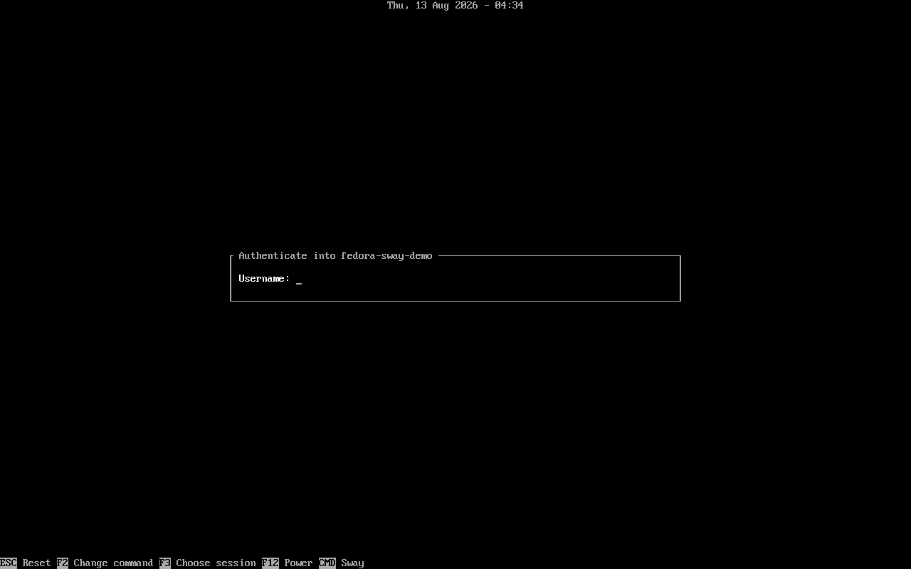
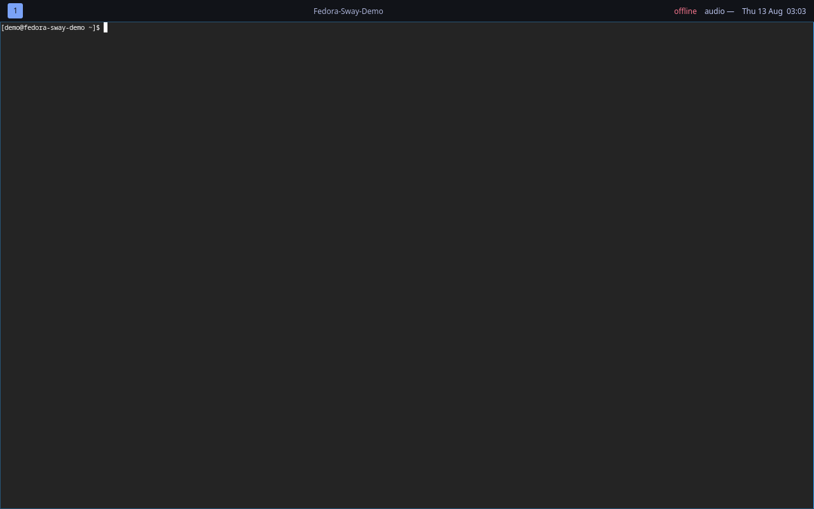
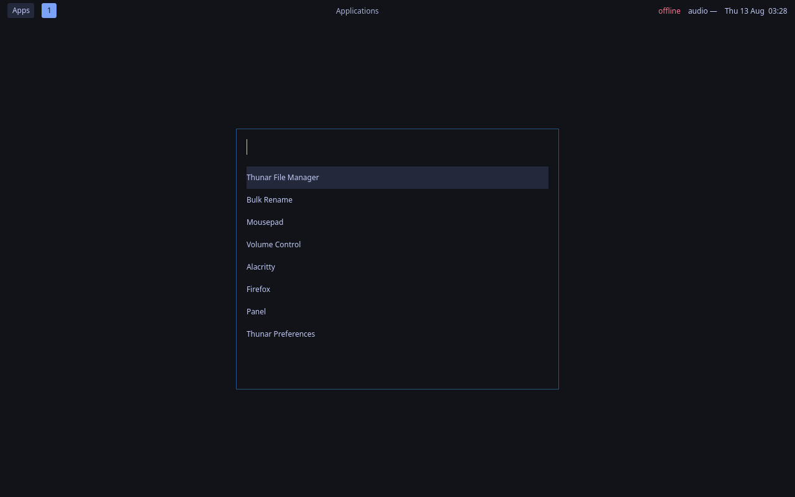
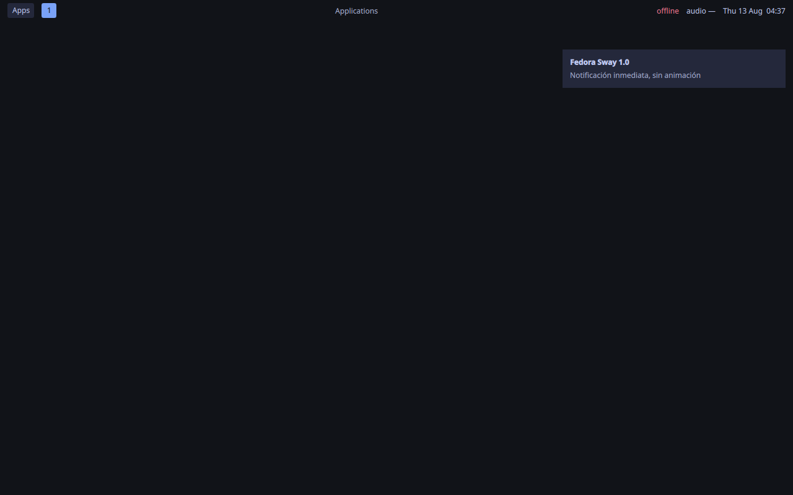
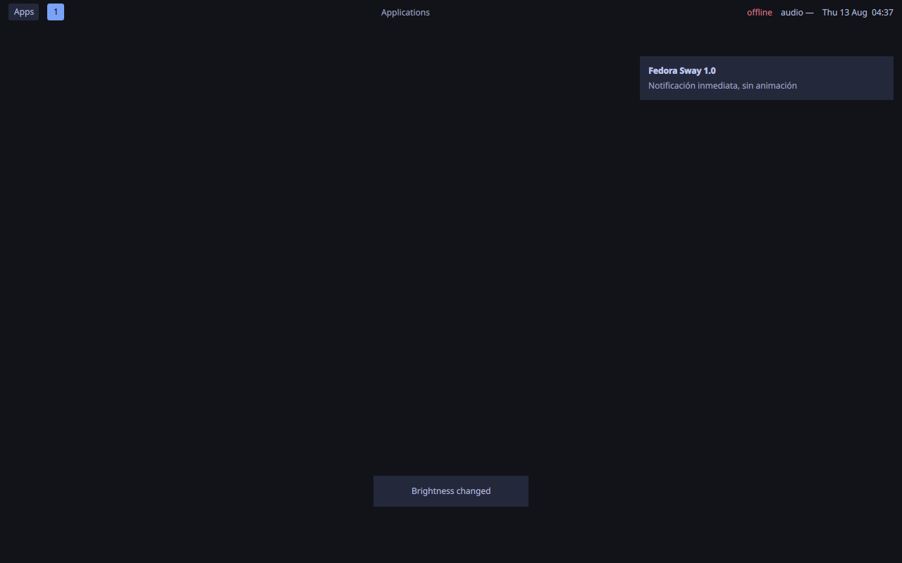
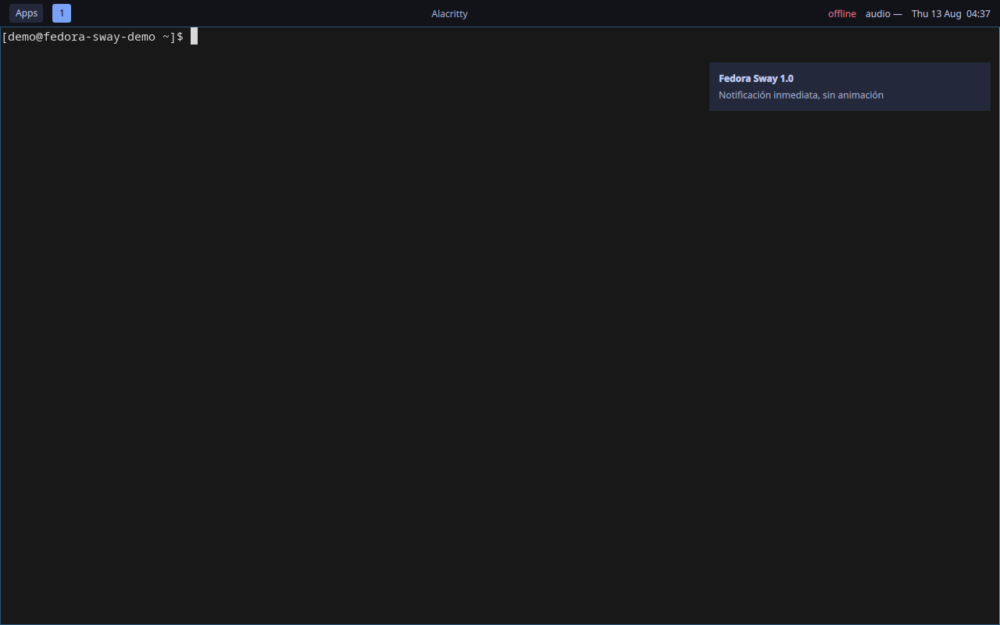
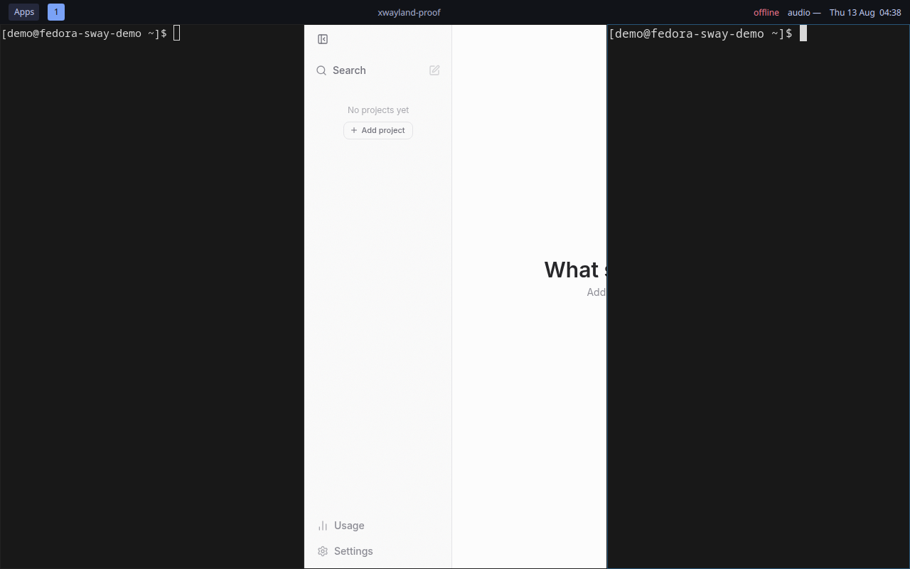

# Fedora Sway + Quickshell Workstation

A small, auditable personal development layer for Fedora Server 44. Fedora remains in
charge of the operating system; this repository adds Sway, an event-driven
Quickshell UI, independent idle/lock/polkit processes, and validation tools.

Version 1.0 prioritizes performance and laptop efficiency. It configures no
animations, visual effects, recurring subprocess polling, external package
repositories, autologin, SELinux changes, firewall changes or privileged group
membership. T3 Code and Codex are explicit, pinned application artifacts; they
do not add a DNF repository.

## Observed Fedora 44 VM

These are observed Fedora Server 44 acceptance-VM images using this repository.
The login is a VM framebuffer capture; desktop images are direct `grim`
captures from inside the Sway session.

### Login



### Desktop and bar



### Launcher



### Notification popup



### Brightness OSD



### Development terminal and T3 Code





## From a clean Fedora Server 44 installation

```bash
sudo dnf upgrade --refresh
git clone https://github.com/tears-mysthrala/fedora-sway-quickshell.git
cd fedora-sway-quickshell
./install.sh --dry-run
./install.sh
```

The installer verifies every declared package's selected repository before
mutating RPM state. Enabled third-party repositories are left untouched, but
a project package resolving from one causes a clear failure. Conflicting
configuration is backed up below
`~/.local/state/fedora-sway-quickshell-demo/` before repository-owned symlinks
are created.

Run `./install.sh` again to confirm convergence. `./install.sh --check` performs
platform/package checks without changing configuration.

## Start the session

Reboot after the first installation. The official Fedora greetd package offers
the packaged **Sway** session and never performs autologin. TTY recovery remains:

```bash
exec dbus-run-session sway
```

The default terminal binding is `Super+Enter`; the launcher is `Super+D`.
`Super+Shift+R` restarts Quickshell without restarting Sway, and
`Super+Shift+E` opens a confirmation before logging out.

Inside a Wayland VM viewer, the host compositor may consume `Super`. No
conflict-free keyboard fallback proved reliable with this VNC backend: F9 is
host dictation, F10 is GTK's menubar, and `Ctrl+Alt` releases the viewer. Use
the clickable `Apps` button in the bar to open the launcher without keyboard
capture. No host/viewer shortcut is reassigned by the demo.

Run `./doctor.sh` inside the graphical session. It distinguishes installed
software from active processes, services, D-Bus integration, and checks that
require manual interaction. Run `./benchmark.sh ab` only when ready to leave
the machine untouched for two ten-minute measurement intervals.

## MKDL development toolchain

The default install includes the small native development surface used by MKDL:
Git/LFS, rootless Podman and Compose tooling, C/C++, Rust, Python, PostgreSQL
client tools, Node 22, Neovim, ripgrep, ShellCheck and Codex CLI.

Do not install Fedora 44's native `elixir` RPM for Kurogane Hub: it is older
than the repository's runtime floor. Use the digest-pinned CI-compatible
toolchain instead:

```bash
cd ~/Work/kurogane-hub
/path/to/fedora-sway-demo/scripts/mkdl-elixir.sh elixir --version
/path/to/fedora-sway-demo/scripts/mkdl-elixir.sh mix test
```

The first invocation downloads a pinned OCI image. Inside Kurogane Hub it
automatically honors that repository's `.forgejo/release-ci-image.txt`, giving
the same Node/Python/Chromium/PostgreSQL/native-build surface as CI; generic
Mix directories use the smaller pinned fallback. It runs rootless, mounts the
working directory plus a dedicated tool cache, and leaves no Elixir service
resident.

Kurogane's registry is private. Authenticate it once with the owner's Forgejo
registry credentials before the first repository-local command:

```bash
podman login herrementari.mkdl.jp
```

The VM confirms that anonymous access is rejected and that the wrapper stops
with this instruction instead of silently substituting the smaller generic
image. Registry credentials are never copied by this repository.

### Codex CLI

OpenAI now publishes a Fedora-compatible ChatGPT Linux preview, but its RPM
enables OpenAI's package repository. Version 1.0 does not add that external
repository because the requested local development path is already covered by
Codex CLI plus T3 Code. npm is retained solely for the pinned Codex artifact;
the installer puts it in a project-owned user prefix and records its registry
integrity in `config/project.conf`.

After installation, authenticate interactively without putting credentials in
this repository:

```bash
codex login
codex --version
```

T3 Code is installed from its official Linux AppImage with a pinned SHA-256.
Launch it from `Apps`, with `Super+A`, or from a terminal:

```bash
t3code
```

## Removal

```bash
./uninstall.sh
```

This removes only managed links and project user units, restores safe backups,
and lists packages added by the demo. It never removes shared packages.

See [architecture](docs/ARCHITECTURE.md), [dependencies](docs/DEPENDENCIES.md),
[performance](docs/PERFORMANCE.md), and
[troubleshooting](docs/TROUBLESHOOTING.md). Version 1.0 gates and migration
boundaries are in [acceptance](docs/ACCEPTANCE.md),
[migration](docs/MIGRATION.md), and [updates](docs/UPDATES.md).
